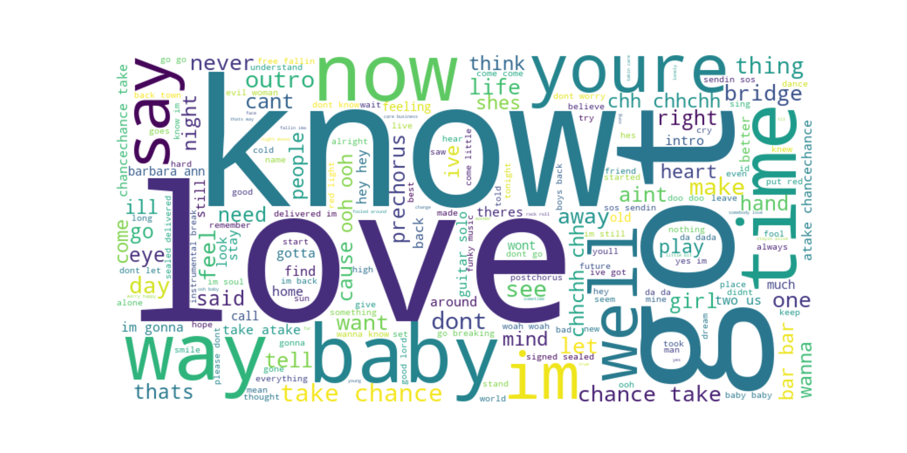
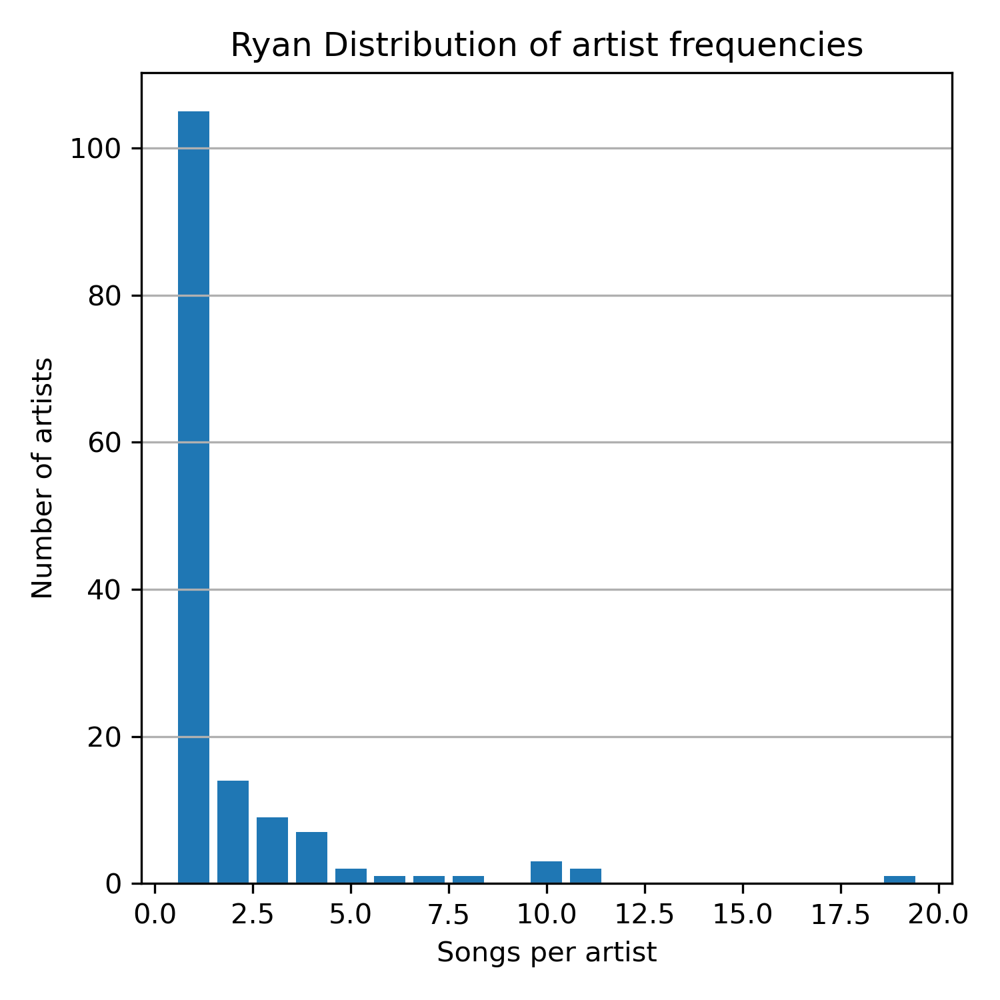
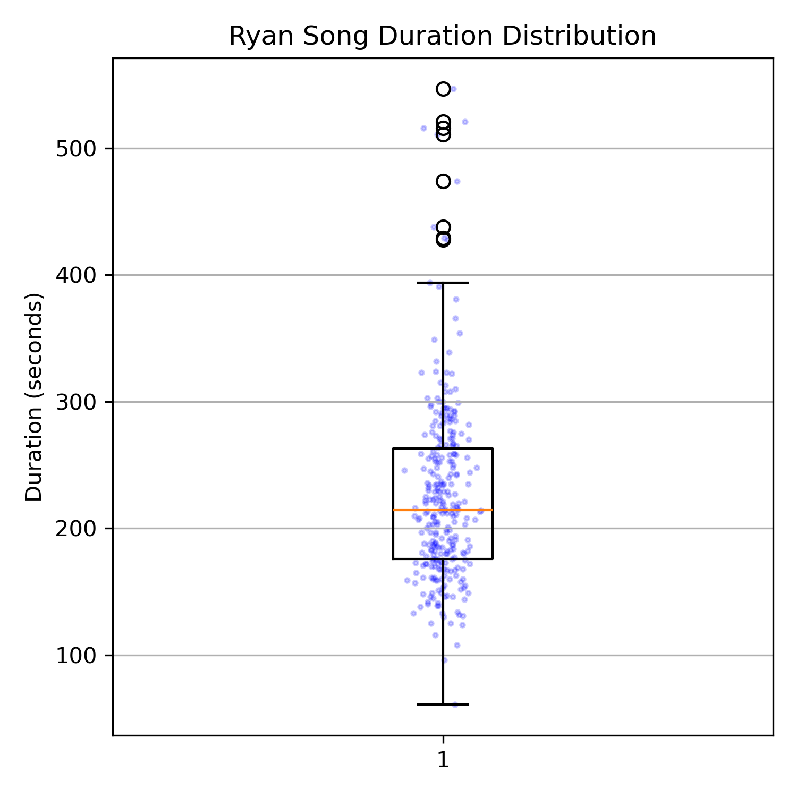
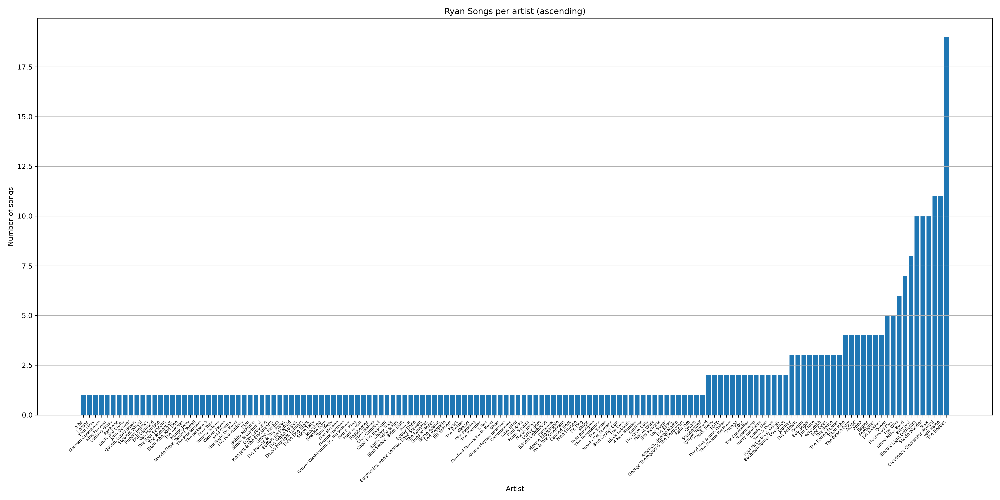

# Contraplay
For [Contrapuntal](https://en.wikipedia.org/wiki/Counterpoint) [Playlists](https://en.wikipedia.org/wiki/Playlist)



**Contraplay** is a lightweight Python tool for parsing, analyzing, and visualizing music playlists from `.csv` files or Spotify URLs. It offers:

- 📊 **Artist frequency distribution plots**
- ⏱️ **Song duration boxplots**
- ☁️ **Word clouds from lyrics using Genius API**
- 🔁 **Playlist intersections & Venn diagrams**


## Quick Start
### Clone and install dependencies
```shell
git clone https://github.com/RyanTomich/contraplay.git
cd contraplay
pip install -r requirements.txt
```

### setup .env
create a .env with the following
```text
export SPOTIFY_CLIENT_ID="xxxxxx"
export SPOTIFY_CLIENT_SECRET="xxxxxx"
export GENIUS_ACCESS_TOKEN="REMOVED"
```
⚠️ Note: Never share or commit your API tokens publicly.cat


## Example
```python
from contraplay import parse_spotify_url, wordCloud
import lyricsgenius
import os

classics_playlist_url = 'https://open.spotify.com/playlist/xxxxxxxxx'
ryan_playlist = parse_spotify_url(classics_playlist_url, tag='Ryan')

# Playlist stats
ryan_playlist.artist_frequency_dist() # ./Ryan_artist_frequency_bar.png
ryan_playlist.artist_frequency_dist(freq=True) # ./Ryan_artist_frequency_dist.png
ryan_playlist.duration_box() # ./Ryan_duration_box.png

# WordCloud
genius = lyricsgenius.Genius(os.getenv("GENIUS_ACCESS_TOKEN"))
wordCloud(intersect, genius) # ./Ryan_wordCloud.png
```





```python
# plot the intersection
p1 = parse_spotify_url('https://open.spotify.com/playlist/xxx1', tag='p1')
p2 = parse_spotify_url('https://open.spotify.com/playlist/xxx2', tag='p2')

common = playlist_intersection(p1, p2)
visualize_intersection_venn(len(p1), len(p2), len(common))

```

## csv parsing
To parse from csv, need the following format
```csv
1
Song Title
Artist Name
Album Name
3:45
2
Song Title
Artist Name
...
```
